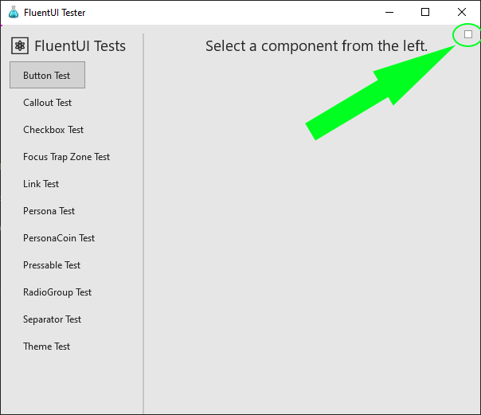
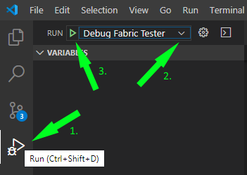

`RNTester` is the test app that we use to test our FluentUI components during development.

## Launch `RNTester` app

1. After you've cloned the repository for the first time, follow the instructions [here](../../README.md) to install npm packages and build the entire repository.

2. Then go into `experiments\tester` folder:

```
    cd experiments\tester
```

3. Build the RNTester bundle:

```
    yarn bundle
```

4. Launch the RNTester app:

```
    yarn run-win32
```

## Debug `RNTester` app with direct debugging

We recommend using [Visual Studio Code](https://code.visualstudio.com/download) for direct debugging.

1. Follow the same step #1 as above.
2. Follow the same step #2 as above.

3. Build the RNTester bundle with dev option. This will ensure source map is included in the bundle.

```
    yarn bundle-dev
```

4. Launch the RNTester app:

```
    yarn run-win32
```

5. Inside ReactTest, open the debug option menu and select the checkbox `Use Direct Debugger`



6. In Visual Studio Code, open the debug pane and select `Debug Fabric Tester` option from the "Run And Debug" dropdown.



7. At this time, VS Code will attach to the JS runtime and you can start debugging. For more information on debugging in VS Code, please see [Visual Studio Code documentation](https://code.visualstudio.com/docs/editor/debugging).

## Debug `RNTester` app with web debugging

1. Follow the same step #1 as above.
2. Follow the same step #2 as above.
3. Start the debug server:

```
    yarn start
```

4. Open Edge or Chrome and navigate to http://localhost:8081/debugger-ui

5. Open another command prompt and go into the same location `experiments\tester` and run:

```
    yarn run-win32-web
```
